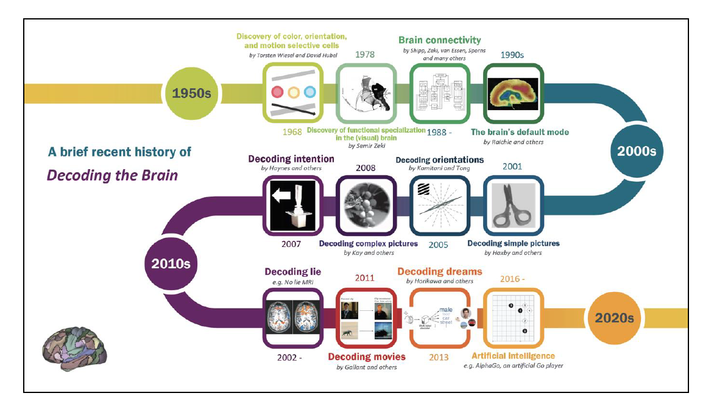

```{r setup, include=FALSE}
knitr::opts_chunk$set(echo = TRUE)
```

# Introduction

The rapid advancement of neuroimaging technologies and high-performance computing (HPC) has enabled neuroscience researchers to collect unprecedented amounts of brain data, often referred to as “big brain data.” This wealth of information allows scientists to revisit longstanding questions and explore new ones on a much larger scale. Indeed, there is, especially in neuroscience, a increasing demand for novel statistical tools. Statisticians play a vital role in this process, not only by developing models to analyze and interpret data but also by incorporating biological insights into these frameworks, making them more reflective of the underlying neural processes.

The impact of statistics on human neuroscience can be discussed through the three main concepts of statistics defined by Ronald Fisher, father of modern statistics:

- the study of populations, 
- the analysis of variance, 
- data reduction. 

These foundational principles are central to key areas of brain research, such as understanding connectivity between brain regions, modeling the flow of information within and between areas, and extracting meaningful patterns from large-scale neuroimaging data. For example, predictive models are now frequently employed to anticipate disease progression or classify patients based on brain features.

#### Study of populations

Neuroscience research often involves three types of populations: 

- population across individuals, 
- population across time, 
- population across brain regions. 

Imagine scanning the brains of 100 individuals in an MRI scanner on a single day. Here, the population is formed by the aggregate data across these subjects, capturing inter-individual variability. If we scan one individual every day for a year, the population shifts to reflect temporal changes in the same person’s brain over time. Finally, if we examine connections across multiple regions within a single brain, the population arises from spatial variability. 

#### Analysis of variance

Each of these populations introduces different types of variance--between individuals, across time, or spatial--all of which require tailored statistical methods to understand and quantify.

#### Data reduction

One of the challenges in neuroscience is dealing with the scale of the data. Data sets often contain hundreds of terabytes or even petabytes of information, which, though rich in detail, can be noisy. Summarizing this data effectively is critical for ensuring that statistical models and computational tools can handle it efficiently. Moreover, the brain itself provides a fascinating model for how to manage complexity: it distills ever-changing sensory inputs into stable, universal patterns, such as color or motion perception. Inspired by this, statisticians aim to extract smaller, representative data sets that capture key patterns across individuals or regions, distinguish healthy subjects from patients, and track changes in mental states or disease progression over time.

### Statistical integration in Neuroscience

Predictive modeling offers exciting opportunities in neuroscience, enabling applications such as brain disease diagnosis and decoding mental states. However, it also brings challenges, especially with causal inference. Causal inference aims to determine whether an observed relationship between two variables reflects a true cause-and-effect relationship. For example, irregular neural signals in a specific brain region may correlate with a mental disorder, but this association does not necessarily imply causation. These signals could be an effect of the disorder, or the relationship could arise from a coincidental correlation caused by unmeasured factors. This challenge is further exacerbated in high-dimensional brain data, where spurious correlations or incidental endogeneity—features unintentionally correlated with the model’s error terms—can violate critical assumptions and lead to misleading conclusions.

```{r history, echo = FALSE}

```

This figure provides a visual overview of how advancements in neuroscience and statistical methods have evolved together to decode the brain. 

At its core, statistical inference allows researchers to generalize findings from a small sample to a broader population. This process is essential in neuroscience, where directly observing every aspect of the brain is unfeasible. Careful attention to data validity and robustness ensures that these generalizations are meaningful and scientifically sound.\
For instance, consider a study of a neuron’s firing rate. Researchers may relate this activity to an animal’s position in a spatial environment, its running speed, or the luminance of a visual stimulus. Similarly, the study of synaptic receptor roles—such as NMDA (N-Methyl-D-Aspartate) or GABA (Gamma-aminobutyric acid) receptors in the hippocampus—illuminates mechanisms underlying cognitive tasks like spatial learning. These examples illustrate how statistical inference connects observations from experiments to theoretical understanding of brain function. \

The integration of statistical analysis, computer science technologies and brain studies is advancing our understanding of brain function and inspiring brain-like computers. Neural networks, for instance, are designed following the structure and operation of the brain. McCulloch and Pitts laid the groundwork for artificial neural networks by conceptualizing a logical calculus for neural activity, framing the brain as a computational device. Similarly, Hebb’s rule, often summarized as “neurons that fire together, wire together,” provided a biological basis for learning mechanisms, influencing the design of Rosenblatt’s perceptron—the first artificial neural network capable of performing simple tasks. Many neural network-based model have begun to outperform humans in certain tasks, such as AlphaGo which demonstrated unprecedented strategic thinking playing chess. 
Despite these successes, these models fail to fully replicate the brain’s structures and processes. The collaboration between statistics and neuroscience can bridge this gap: neuroscientists need statistical models capable of deciphering the brain's dynamic, while statisticians require deeper insights into the nervous system to enhance the biological plausibility of their models.
This synthesis not only aids in understanding the brain’s inner workings but also bridges the gap between data and discovery.

# Introduction to R

#### What is R

R is a programming language that includes conditionals, loops, and the ability to define custom functions allowing data processing and graphical representation in the statistical domain. R serves as an environment where various statistical techniques are implemented and made available as *packages*. Approximately 25 packages are included in the base `R` environment, referred to as "standard" and "recommended." All other packages are available through the R CRAN website: <https://cran.r-project.org/>.

#### Why Use R:

- Free software, available for download at the link above;
- Available for multiple platforms (Windows, Linux, Macintosh);
- Constantly developed and improved;
- Versatile, allowing the development of new procedures.

It is possible to interact with R using **RStudio** (available at https://rstudio.com/). RStudio allows users to write ".R" files containing commands that can be executed in the R command prompt. Additionally, it provides faster access to plots, the environment (variables and functions defined during the session), and the help documentation.

#### Rstudio and GitHub

Git is an open-source version control system. It means that whenever a developer develops some project (like an app) or something, he/she constantly update it catering to the demands of users, technology, and whatsoever it maybe. Version control systems keep these revisions straight, storing the modifications in a central repository. It allows developers to easily collaborate, as they can download a new version of the software, make changes, and upload the newest revision. Every developer can see these new changes, download them, and contribute. Git is used to storing the source code for a project and track the complete history of all changes to that code, while **GitHub** is a cloud-based platform built around the Git tool. 

It is possible to link a *Rstudio project* to a *GitHub repository*. \ RStudio projects make it straightforward to divide your work into multiple contexts, each with their own working directory, workspace, history, and source documents. To create a new project in the RStudio IDE, use the `New Project` command (available on the `Projects` (top right corner) menu or go to `File > New Project`. RStudio creates a project file (with an `.Rproj` extension) within the project directory. This file contains various project options and can also be used as a shortcut for opening the project directly from the filesystem.

For more details:

- https://rfortherestofus.com/2021/02/how-to-use-git-github-with-r/
- https://annakrystalli.me/talks/r-in-repro-research.html#27

## Rmarkdown

Rmarkdown [@xie2018r] is a powerful tool for combining analysis and reporting into the same document. A complete guide can be found at https://bookdown.org/yihui/rmarkdown-cookbook/. \
To use Rmarkdown we need to install the package `rmarkdown`
```{r install_rmarkdown, eval=FALSE}
install.packages("rmarkdown")
```
```{r}
library(rmarkdown)
```

A Rmarkdown `.Rmd` document has three components:

1. *yaml*: the document starts with yaml for setting metadata, e.g. title, output format. You can also specify bibliography as `.bib` file (it must be in the same folder of the .Rmd file) or specify the full path where the .bib file is. For example, the yaml part of the current document is 
```{r example_yaml, eval = FALSE}
---
title: "Introduction to Statistics and R for Neuroscience"
output:
html_document:
    df_print: paged
date: ''
bibliography: notes.bib
---
```
Possible `output` formats include HTML, PDF, WORD, LaTeX. \
2. *text*: this is equivalent to writing in a text editor, but more powerful and interesting for how the document is generated. Some simple rules: 

- Multiple spaces on a given line are reduced to one;
- Line endings with fewer than two spaces are ignored;
- Two or more spaces at the end of lines introduce hard breaks, forcing a new line;
- Lines starting with the greater-than sign > introduce block quotes;
- One or more blank lines introduce a new paragraph;
- Text with the syntax `<!- - comments - - >` is omitted from output;
- The sign `#` introduces headers; lower levels are created with additional signs - up to total five levels;
- `*italics*` becomes *italics*;
- `**bold**` becomes **bold**;
- `[see this website](website_url)` becomes [see this website](website_url);
- you can also insert inline equations between a pair of single dollar sign, e.g. `$E=mc^2$` is displayed as $E=mc^2$;
- Block equations go in between a pair of double dollar signs, e.g. `$$E=mc^2$$` $$E=mc^2$$
- Lines starting with asterisk $*$ as well as plus $+$ or minus $-$ signs introduce lists.

3. *code chunks*: portions where to insert some code, e.g. for R script. A code chunk takes a language engine (R, Pyhton, ...), and a label, that can be used for navigating through error messages. Duplicated labels lead to errors during compilation. Some of the most used options:

- `include = FALSE`: do not include the output;
- `echo = FALSE`: do not print the code;
- `warning = FALSE`: exclude the warning message;
- `comment = FALSE`: exclude the comments;
- `eval = FALSE`: do not run the code;
- `out.height = 50%, out.width = 50%`: define the size of figures as they appear in the output document;
- `fig.align="center"`: Define the alignment of figures - left, right, or center;
- `fig.caption="my caption"`: Define the caption for figures. \
The complete list of options is available at https://yihui.org/knitr/options. \
It is possible to include a figure in a Rmarkdown document:

- `` in the text;
- `knitr::include_graphics("Images/figure.extension")` in a code chuck;
- directly using R functions in a code chuck. 

## Basics concepts

For a detailed introduction to R sintax and commands please see the book [@long2019r] or the Supplemental material with code examples and exercises of the [R cookbook](https://rc2e.com/).

R has a very simple syntax. It is *case sensitive*, meaning it distinguishes between uppercase and lowercase letters. 
The basic commands include *assignments* and *expressions*. When an expression, consisting of certain operations, is written in the prompt, it is interpreted as a command, executed, and its result is displayed (unless specified otherwise) but immediately lost. After the expression is executed, the result is stored in a variable and not displayed. For example:
```{r}
x <- 2 + 3
x
```
In this case, we need to explicitly request the value to display it. \
Commands can be separated by a semicolon (;) if written on the same line. Otherwise, a newline is sufficient. While using semicolons reduces the number of lines, it is discouraged as it affects code readability.

To obtain more information about any function, you can use the help command. For example, to learn about the mean function:
```{r, eval=FALSE}
help(mean)
```
or alternatively `?mean`.
Comments can be added to the code using the `#` symbol. Everything following the `#` until the end of the line is considered a comment.

Basic mathematical operations for addition, subtraction, multiplication, and division use the standard symbols $+$, $-$, $*$, and $/$. For exponentiation, use $**$ or \^. The output of a command is preceded by an index enclosed in square brackets. For example:
```{r}
2 + 3 * 4
```
Operations follow the standard order of operations.

The following table summarizes the comparison and logical operators in R:


|Operator|Description          |
|--------|---------------------|
| <	     |Less than            |
| >      |Greater than         |
| $\le$  |Less than or equal   |
| $\ge$  |Greater than or equal|
| $==$   |Equal to             |
| $!=$   |Not equal to         |
| \&     |AND                  |
| !	     |NOT                  |

These operators are primarily used to verify conditions in R. For example
```{r}
4 * 2 == 2^3
```
Note: In R, TRUE and FALSE are binary values where TRUE corresponds to 1 and FALSE to 0.

At the end of an R session, all created objects can be permanently saved in a file with the .RData extension in the current directory. The command history is saved in a .Rhistory file. When R restarts in the same directory, the workspace and history are loaded automatically. It is good practice to set the working directory at the start of a session using `setwd()`
```{r, eval=FALSE}
setwd("C:/desired/directory")
```

## Types of objects

### Vectors

R operates on named data structures. The simplest type of structure is a numeric vector, which is an ordered collection of numbers. You can define a vector using the `c()` (concatenate) command as follows
```{r}
x <- c(1, 2, 3, 4)
x
```
Here, we have created a vector with 4 elements. Note that the assignment operator `<-` points directly to the object receiving the assignment. Alternatively, the $=$ symbol can be used. Assignments can also be written in the reverse direction
```{r}
c(1, 2, 3, 4) -> x
```
You can also define a new vector by concatenating existing ones
```{r}
y <- c(x, 0, x)
```
In this case, we create a vector of 9 elements by concatenating x, 0, and x again. To determine the length of a vector, use the `length()` function:
```{r}
length(y)
```

#### Arithmetic Operations on Vectors
Operations between vectors are performed element by element. Vectors involved in an operation do not necessarily need to have the same length. If they differ, the shorter vector is recycled until it matches the length of the longer one. For example:
```{r}
v <- 2 * x + y
v
```
Note: If the lengths of the vectors are not multiples of each other, R will still perform the operation but issue a warning.

In addition to basic arithmetic operations, there are commands for specific mathematical functions, such as `log` for logarithm, `sqrt` for square root, `exp` for exponential, `sin` for sine, `cos` for cosine, and `abs` for absolute value. Given a vector `x`, `min(x)` and `max(x)` return the smallest and largest values, respectively. The function `range(x)` returns a vector of length 2 with the minimum and maximum values. `sum(x)` and `prod(x)` return the sum and product of the elements of `x`, respectively. Lastly, the function `sort(x)` returns a vector of the same length as `x` sorted in ascending order.

#### Sequences
R can easily generate sequences of numbers. For example
```{r}
1:10
```
The colon operator has precedence over other operations. For instance, to generate the first 10 even numbers, you can use
```{r}
2 * 1:10
```
You can also create descending sequences
```{r}
10:1
```
To create sequences with a specific step size or length, use the `seq()` function. For example
```{r}
s1 <- seq(-1, 1, by = 0.2)
s1

s2 <- seq(0, 2, length.out = 5)
s2
```

#### Selecting and Modifying Parts of a Vector
You can select a subset of a vector using square brackets `[]`. The content inside the brackets specifies the indices to extract or modify. Common methods include:
```{r}
y
# extract first element
y[1]
# extract elements from position 3 to 6
y[3:6]
# extract element in positions 2, 4, 8
y[c(2, 4, 8)]
```
We can excludes elements at the specified positions
```{r}
y[-(1:4)]
```
or selects elements which satisfy a certain condition (corresponding to TRUE)
```{r}
y[y > 2]
```
You can also modify elements of a vector by assigning new values:
```{r}
y[y == 1] <- -2
y
```


### Matrices

In general, a matrix is a two-dimensional generalization of a vector. The base function to create a matrix is `matrix()`. If no arguments are provided, a matrix with a single column is created:
```{r}
matrix(1:5)
```
Note that this is not equivalent to a column vector, as a second dimension is still defined.
The indices shown in the output indicate the row and column of the element within the matrix. To create a matrix with specific dimensions, you need to specify them:
```{r}
matrix(1:6, nrow = 2)
```
By default, matrices are filled column-wise. To fill them row-wise, use the `byrow = TRUE` argument:
```{r}
matrix(1:6, nrow = 2, byrow = TRUE)
```
You can also specify the number of columns using the `ncol` argument.
Given a matrix `A`, you can determine its dimensions using the `dim()` function, which returns a vector with the number of rows and columns.

#### Constructing Matrices from Existing Vectors
A matrix can also be built from an existing vector. Consider the following vector containing data on the area, population, and altitude of three Italian cities:
```{r}
dati <- c(157.88, 120709, 194, 52.29, 107816, 262, 140.86, 395149, 54)
```
Using the `matrix` function, we can create the `province_dati` matrix:
```{r}
province_dati <- matrix(dati, nrow = 3, byrow = TRUE)
province_dati
dim(province_dati)
```

#### Naming Rows and Columns
Row and column names can be assigned using the `rownames()` and `colnames()` functions:
```{r}
rownames(province_dati) <- c("Trento", "Bolzano", "Bologna")
colnames(province_dati) <- c("Area", "Population", "Altitude")
province_dati
```
Alternatively, the `dimnames()` function can be used to assign both row and column names simultaneously
```{r}
dimnames(province_dati) <- list(c("Trento", "Bolzano", "Bologna"), 
                                  c("Area", "Population", "Altitude"))
```
To retrieve row or column names without assigning new ones
```{r}
colnames(province_dati)
dimnames(province_dati)
```

#### Accessing Matrix Elements
To access specific elements of a matrix, use square brackets `[row, column]`. For example, to retrieve the population of Trento (row 1, column 2):
```{r}
province_dati[1, 2]
```
To retrieve all data for Bolzano (row 2):
```{r}
province_dati[2, ]
```
You can also use row and column names for indexing:
```{r}
province_dati["Bologna", "Area"]
```

#### Operations on Matrices
Matrices support element-wise operations such as addition, subtraction, multiplication, and division. Consider the following matrices
```{r}
A <- matrix(0:5, nrow = 2, ncol = 3)
B <- matrix(seq(0, 10, 2), nrow = 2, ncol = 3)
```
Element-wise addition and subtraction:
```{r}
A + B
A - B
```
Element-wise multiplication and division:
```{r}
A * B
A / B
```
Division by zero results in `NaN` (Not a Number), indicating invalid numeric operations.

#### Adding Rows and Columns
You can add rows or columns to an existing matrix using `rbind()` and `cbind()`. For example, to add a column for population density:
```{r}
Density <- province_dati[, "Population"] / province_dati[, "Area"]
Density <- round(Density, digits = 2)
province_dati <- cbind(province_dati, Density)
province_dati
```
To add a new row for another city:
```{r}
Trapani <- c(273.13, 65431, 3, 239.56)
province_dati <- rbind(province_dati, Trapani)
province_dati
```

### Multi-Dimensional Arrays
Beyond matrices, R supports higher-dimensional arrays. For example:
```{r}
x <- array(1:24, c(3, 4, 2))
x
```
This creates a 3x4x2 array. Array dimensions and elements can be accessed in a similar way to matrices.

### Qualitative Variables (Factor)

An object of type `factor` is used to indicate a discrete classification (or grouping) of the elements in a vector of the same length. For example, consider the data for the height of 30 individuals whose gender is specified as:
```{r}
genere <- c("F", "M", "M", "F", "M", "F", "F", "F", "M", "F", 
            "M", "M", "F", "F", "M", "M", "M", "F", "F", "M")
```
A factor is created using the `factor()` function
```{r}
generef <- factor(genere)
generef
```
Factors have a representation slightly different from vectors. They include the possible `levels` that the variable can take. To retrieve the levels of a factor
```{r}
levels(generef)
```
Continuing the example, consider the following height values for individuals, expressed in centimeters
```{r}
Altezza <- c(145.1787, 185.0102, 195.1313, 161.1447, 186.5746, 148.6862, 
             166.3729, 150.0860, 175.6791, 157.0512, 167.5121, 188.3428, 
             152.6443, 171.8734, 181.6952, 187.6279, 200.6651, 153.4996, 
             163.1848, 180.1263)
```
We can perform operations on this vector with respect to the levels of the factor using the `tapply()` function
```{r}
tapply(Altezza, generef, mean)
```
Here, we computed the average height of individuals grouped by gender (using the factor variable). The `tapply` function requires the vector to operate on, a factor of the same length, and the function to apply. The output displays the results labeled by the levels used.
Similarly, you can use the by() function:
```{r}
by(Altezza, generef, mean)
```

#### Ordered Factors
By default, factor levels are sorted alphabetically. To specify a custom order for the levels, use the levels argument within the factor() function. For instance, consider a variable `Grado` representing education levels with levels ordered as 'S: diploma superiore' < 'L: laurea' < 'D: dottorato':
```{r}
Grado <- c("S", "D", "D", "S", "D", "S", "L", "S", "S", "L", 
           "S", "D", "S", "S", "L", "L", "S", "D", "D", "D")
Grado
Gradof <- factor(Grado, levels = c("S", "L", "D"), ordered = TRUE)
Gradof
```
Alternatively, you can use the ordered() function to create an ordered factor:
```{r}
ordered(Grado, levels = c("S", "L", "D"))
```

### Data Frames
Suppose we want to add a column to the matrix `province_dati` containing the corresponding province abbreviations
```{r}
Sigla <- c("TN", "BZ", "BO", "TP")
```
Using the `cbind()` function, we can add this vector to the matrix
```{r}
province_dati1 <- cbind(province_dati, Sigla)
province_dati1
```
However, adding a column of strings converts all numeric vectors in the matrix to strings (note the quotation marks). This happens because arrays (of any dimension) can only contain objects of the same type.
To avoid this issue, we use data frames, which are similar to matrices but can contain vectors of different types. Create a data frame with the `data.frame()` function
```{r}
province_frame <- data.frame(province_dati, Sigla)
province_frame
```
Additionally, columns can be accessed directly using the `$` operator:
```{r}
province_frame[, 3]
province_frame$Altitude
```
Alternatively, you can attach the data frame to make its columns directly accessible by name
```{r, message=FALSE}
attach(province_frame)
Population
```
To remove direct access, use the `detach()` function:
```{r}
detach(province_frame)
```
To get an overview of a data frame’s structure, use the `str()` function:
```{r}
str(province_frame)
```

### Lists

Data frames generalize matrices, allowing operations on objects that can include numeric vectors. A more flexible structure is the list, which allows combining objects of different types and dimensions, such as matrices, character vectors, and data frames.
For example, given the following elements
```{r}
A <- matrix(c(1, 0, 0, 1), nrow = 2)
regioni <- c("Trentino-Alto Adige", "Emilia Romagna", "Sicilia")
```
We can combine them into a single list:
```{r}
lista <- list(A, regioni = regioni, province_frame)
lista
```
List elements can be accessed using double square brackets `[[ ]]` or their assigned names
```{r}
lista[[1]]
lista[["regioni"]]
```
You can add new elements to a list using the `$` operator
```{r}
lista$vettore <- 1:5
lista
```
The functions `lapply()` and `sapply()` can be used to perform operations on all elements of a list. Note: Internally, data frames are a special case of lists where each list element is a vector of the same length.


### Special Operators

In R, several special functions and objects are included. 
If some requested information is unavailable, it is conventionally represented with `NA`. For example:
```{r}
province_frameNA <- province_frame
province_frameNA$Population[2] <- NA
province_frameNA$Population
```
Any operation involving a missing value will result in a missing value:
```{r}
min(province_frameNA$Population)
```
Many functions allow you to ask R to remove missing data using the argument `na.rm = TRUE`
```{r}
min(province_frameNA$Population, na.rm = TRUE)
```
To check if a vector contains NA, use the `is.na()` function, which returns `TRUE` or `FALSE` for each element
```{r}
is.na(province_frameNA$Population)
```
To determine if there is at least one missing value in a vector, use the `any()` function
```{r}
any(is.na(province_frameNA$Population))
```
To find the positions of missing values, use the `which()` function
```{r}
which(is.na(province_frameNA$Population))
```
Note: The `which()` function generally takes a vector of `TRUE` and `FALSE` and returns the indices corresponding to `TRUE`.
Other special objects (with analogous functions) include:

- `Inf` to indicate infinity (`is.finite()`).
- `NaN` to indicate "not a number (`is.nan()`).

## Loops and Conditionals

In R, conditional statements can be used in the following form
```{r, eval=FALSE}
if (expr1) expr2 else expr3
```
Here, `expr1` is evaluated. If it returns `TRUE`, `expr2` is executed; otherwise, `expr3` is executed. For example:
```{r}
if (province_frame["Trento", "Population"] > 100000) {
  print("The population of Trento exceeds 100,000 inhabitants")
} else {
  print("The population of Trento does NOT exceed 100,000 inhabitants")
}
```
You can use logical operators (AND, OR, NOT) in the conditions. Specifically, `&` and `|` operate element-by-element for vectors, while `&&` and `||` evaluate only the first element of each vector.
```{r, eval = FALSE}
for (name in expr1) expr2
```
Here, `name` is the loop variable, `expr1` is a vector (usually a sequence like 1:20), and `expr2` is the expression executed during each iteration of the loop.
To execute multiple commands in a loop or conditional, group them with curly braces {}. For example
```{r}
for (i in 1:4) {
  if (!is.na(province_frameNA$Population[i])) {
    print(paste("The city of", rownames(province_frameNA)[i],
                "has", province_frameNA$Population[i], "inhabitants."))
  }
}
```
Another way to create loops is using the while function
```{r, eval=FALSE}
while (condition) expr
```
Here, `expr` is executed as long as condition evaluates to `TRUE`.

## Functions

In R, it is possible to create custom functions. These objects are saved and can be used in other expressions. Writing useful functions allows for more efficient and productive work in R.
So far, we've encountered many built-in functions (e.g., `mean()`, `matrix()`, `cbind()`). In general, a function is defined as:
```{r, eval = FALSE}
name <- function(arg1, arg2, ...) {
  expression
  return()
}
```
- `name` is the function's name (used to call the function),
- `(arg1, arg2, ...)` are the required inputs,
- `expression` contains the commands making up the function body,
- `return()` specifies the function's output.
For example, let’s write a function to calculate the absolute value. The function takes a numeric vector x as input and returns a vector of the same length with the absolute values:
```{r}
absolute_value <- function(x) {
  # If x > 0, then |x| = x
  result <- x
  # If x < 0, then |x| = -x
  result[x < 0] <- -x[x < 0]
  
  return(result)
}

v <- c(-1, 3, -2, 6, -5)
absolute_value(v)
```
Note: The `return()` command is not mandatory. Instead, you can simply write the object to be returned as the last command. For example, the previous function can be rewritten as
```{r}
absolute_value <- function(x) {
  result <- x
  result[x < 0] <- -x[x < 0]
  result
}
v <- c(-1, 3, -2, 6, -5)
absolute_value(v)
```

##### Solving a Linear Equation
Now let’s create a function to solve a first-degree equation $ax + b = 0$. The solution formula is $x=-a/b$. The function accounts for the special case where $a=0$.
```{r}
linear_eq <- function(a, b) {
  if (a != 0) {
    return(-b / a)
  } else {
    print("No solution exists")
  }
}
linear_eq(2, -4)
```
Note: Functions are sensitive to the order of input arguments. For example:
```{r}
linear_eq(-4, 2)
```
To avoid errors due to argument order, specify the input names
```{r, eval = FALSE}
linear_eq(b = -4, a = 2)
```
You can also assign default values to function arguments when defining the function:
```{r}
linear_eq <- function(a = 1, b = 1) {
  if (a != 0) {
    return(-b / a)
  } else {
    print("No solution exists")
  }
}
linear_eq()
```
Note: Assignments made inside a function are local and temporary, and they are discarded once you exit the function.

#### Exercise 1  
Write a function to solve a second-degree equation.

## Data Management

Often, we work with large data sets, and re-executing commands repeatedly can be time-consuming and error-prone. For this reason, it is possible to save data to a file, which can be loaded later as needed.
Suppose we want to create a data frame and save it. For example, consider the following variables:

- **X**: marital status (`Nubile/celibe`, `Coniugato`, `Vedovo/a`, `Separato/divorziato`);
- **Y**: level of education (`Analfabeta`, `scuola dell'Obbligo`, `scuola Superiore`, `Laurea o superiore`);
- **Z**: number of dependents (from 0 to 4);
- **W**: weight.
To simplify the analysis:
- Define `X`, `Y`, and `Z` as factors, where `N`, `C`, `V`, `S` are the levels of `X` and `A < O < S < L` are the ordered levels of `Y`.
- Sample values of `W` from a normal distribution with a mean of 70 and standard deviation of 15.
- Assume 50 individuals.

**Note**: The functions used to generate this example will be introduced and explained later.
```{r}
x <- factor(c("N", "C", "V", "S"))
y <- factor(c("A", "O", "S", "L"))
z <- factor(0:4)
n <- 50
set.seed(37)
X <- sample(x, n, replace = TRUE)
Y <- sample(y, n, replace = TRUE)
Z <- sample(z, n, replace = TRUE)
W <- rnorm(n, mean = 70, sd = 15)
dati <- data.frame(X = X, Y = Y, Z = Z, W = W)
```
Since the data frame contains 50 observations, printing all rows to inspect the data set might not be helpful. Besides the `str()` function, we can use `head()` to print only the first few rows of the data frame
```{r}
str(dati)
head(dati)
```

#### Saving and Loading Data
The easiest way to save an entire session or parts of it is by using the `save()` function, where you specify the objects to be saved. For example
```{r}
save(X, Y, Z, W, dati, file = "peso.Rdata")
```
This creates a file named `peso.Rdata` in the working directory, containing the specified variables. If we only want to save the data frame and remove the other variables
```{r}
save(file = "peso.Rdata", dati, X, Z)
rm(list = ls()) # To remove all object in the working enviroment
```
To load the saved session, use the `load()` function:
```{r}
load("peso.Rdata")
ls()
```
Note: Ensure that the file is in the working directory before attempting to load it. If it is not, you must specify the full file path.

If the object to save is a data frame or matrix (i.e., a table), you can use `write.table()` to save it as a `.txt` file (a compact format). For example
```{r}
write.table(dati, file = "peso.txt", sep = ";")
dati2 <- read.table("peso.txt", sep = ";", header = TRUE)
head(dati2)
```
The character specified in `sep = ""` is used to separate table elements.
The `header = TRUE` argument indicates that the file has a header row identifying variable names. For structured data sets, you can use the following functions, which are variations of `read.table()`: `read.csv` and `read.csv2` for CSV files, the function `readxl` from the package `"readxl"` for XLS and XLSX files.

## Basic Tidyverse

Tidyverse is a collection of R packages designed for data science. Tidyverse packages are:

- optimised to run fast, relying on C++ under the hood
- maintained by a paid staff of talented developers
```{r, eval=FALSE}
install.packages("tidyverse")
```
```{r}
library(tidyverse)
```

Tidyverse is based on the pipe operator i.e.,`%>%`. It connects two function calls by making the value returned by the first call the first argument of the second call
```{r}
c(1:3) %>% rep(3) 
```
returns the same output as
```{r}
rep(c(1:3), 3)
```
We can use the pipe more than one times:
```{r}
c(1:3) %>% rep(3) %>% length()
```
By default the value of the left-hand call is piped into the right-hand call as the first argument. You can make it some other argument by referring to it as the dot ., for example:
```{r}
3 %>% rep(c(1:3), .) 
```

### `dplyr`

Inside the `tidyverse` function we have the useful `dplyr` package. We will see only the main functions of this package, but you can use the basic R command proposed before instead of these ones.

- `filter()`: Subset rows using column values
- `select()`: Subset columns using their names and types
- `mutate()`: Create, modify, and delete columns
- `group_by()`: Group by one or more variables
- `summarize()`: Summarise each group to fewer rows

Let see some examples. First of all, we load the R `dataset` `ChickWeight` from the package `datasets`
```{r}
library(datasets)
data("ChickWeight")
```
You can see the description of this dataset typing help(ChickWeight). So, we want:
1. select only the weight and chick columns:
```{r}
ChickWeight %>% select(weight, Chick) %>% head()
```
and compute the mean of the weight for each chick:
```{r}
ChickWeight %>% select(weight, Chick) %>%
  group_by(Chick) %>%
  summarize(weight = mean(weight, na.omit = TRUE))
```
filter only the chick with weight greater than the global mean
```{r}
ChickWeight %>% select(weight, Chick) %>%
  group_by(Chick) %>%
  summarize(weight = mean(weight, na.omit = TRUE)) %>%
  filter(weight >= mean(weight))
```
For more information please see the Tidyverse Cookbook at https://rstudio-education.github.io/tidyverse-cookbook/.

# Packages for Neuroscience

Ok all good, but what if I want to analyze EEG data, fMRI or other data from neuroscience? 
The Neuroconductor Project (https://neuroconductor.org/) is a large repository of R packages for imaging. It includes 86 packages published on CRAN! You can find the complete list with all the documentations at https://neuroconductor.org/list-packages/all. For example:

- `fmri`: perform an fMRI analysis as described in Tabelow et al. (2006), Polzehl et al. (2010), and Tabelow and Polzehl (2011).
- `eegUtils`: EEG processing and visualization tools.
- `RNifti`: Provides very fast read and write access to images stored in the NIfTI-1, NIfTI-2 and ANALYZE-7.5 formats.

and there are other packages not on CRAN, like:

- `eeguana`: flexible manipulation of EEG data with dplyr-like functions. You must install it using `devtools::install_github("bnicenboim/eeguana")`. 


# References

---
nocite: |
  @durstewitz2017advanced
  @brainsci9080194
  @kass2018
---

